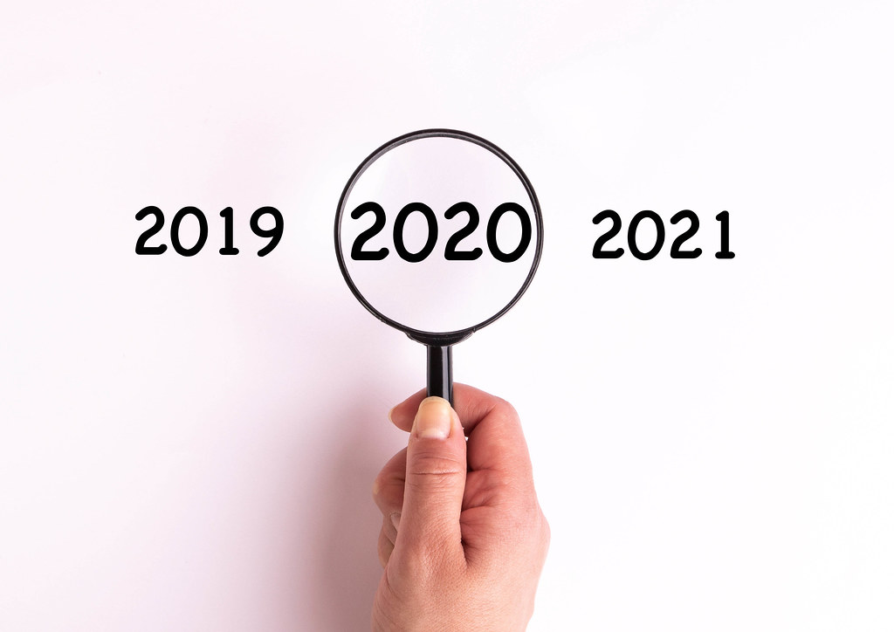

# 서문

지난 2019년을 돌아보며 정리하고, 앞으로 맞이할 2020년의 밑그림을 그리는 글입니다. 

처음으로 작성해보는 글이기에 많이 서툴 수 있습니다. 이걸 작성하는 제 마음은 설레기만 하네요.

이 글은 다음과 같은 내용이 작성될 예정입니다.

- 서문
- 본문 1. 2019년을 정리하며
  - SW마에스트로 연수과정
  - 리더십
  - 학교생활
  - 개발 관련
  - 사람 사는 얘기
- 본문 2. 2020년을 맞이하며
  - 학생회장
  - 개발 공부
  - 자기 계발
  - 대학교
  - PoDo 자율동아리
- 결문

이 글을 씀으로써 현재 많이 복잡한 제 마음을 정리하고, 개운한 마음으로 2020년을 시작했으면 좋겠습니다.

> ※ 글 내용이 길어서 다 읽기 귀찮으신 분들은
>
> ### 이정도 되는 글씨 크기의 제목
>
> 을 가진 파트만 읽으셔도 될 것 같습니다. 

# 본문 1. 2019년을 되돌아보다.

## SW 마에스트로 연수과정

2019년의 시작과 끝을 함께 한 과정입니다. 앞으로 어떤 삶을 살아갈지 모르겠지만, 평생 기억에 남을 경험입니다.

### 시작

제 친구가 준비하는 것을 보고, 나도 해봐야지! 하고 무턱대고 지원했습니다. 처음에는 당연히 선발될 줄 모르고 '일단 해보자'라는 생각을 갖고 지원했습니다. 근데 웬걸. 턱 하니 붙어버렸습니다. 

친구는 불합격했기에 미안한 마음이 컸습니다. 따라서 제게 기회를 안겨준 그 친구에게 도움이 될 만한 정보는 물심양면으로 제공해주며 항상 고마워하며 지내고 있습니다. 항상 고맙다!

### 프로젝트

SnapDrone이라는 프로젝트를 진행하게 되었습니다. 스마트 촬영 드론 쉐어링 서비스인데, 개발 과정이 너무 험난했습니다. 테스트를 위한 장소 마련도 어려웠고, 개발할 때 쓰인 SDK도 자료가 부족해서 무한 삽질을 했습니다.

### 얻은 것들

프로젝트는 기한 내에 완전히 완성하진 못했지만, 돈 주고도 얻지 못하는 훌륭한 경험과 가르침, 그리고 사람들을 얻었습니다.

#### 경험

실패의 두려움 없이 프로젝트에 온전히 집중할 수 있는 꿈과 같은 환경.. 앞으로 인생을 살아도 이런 경험을 다시 해볼 수 있을지는 의문입니다. 연수센터의 씨앗방처럼 집중이 잘 되는 공간을 찾기 어려울 것 같습니다.

또한 하나의 프로젝트를 가지고 완성도 있는 기획을 해봤고, 개발을 해봤기에 아직 부족하기는 해도 보는 눈이 이전보다 더 넓어진 것 같다고 스스로 느낍니다. 

#### 가르침

훌륭하신 멘토님들과 팀원 형들에게 프로젝트에 관련한 조언뿐 아니라, 앞으로의 삶에 있어서 도움이 되는 많은 조언을 들었습니다. 현재 제 삶에 바로 적용해 크게 도움을 받은 조언도 있었고, 앞으로 1년 뒤에 성인이 되어서, n년 후에 사회생활을 하면서 도움을 받을 수 있는 조언들을 새겨두었습니다.

#### 사람들

정말 좋은 사람들을 많이 만났습니다. 그 중 당연히 최고는 팀원 형들입니다. hapco 팀의 @jjuncoder, @kay20kim   형들이랑 같은 팀을 해서 6개월간 정말 행복하고, 즐겁고, 유익한 나날들을 보냈습니다. 

> 언제나 가장 중요한 것은 '사람' 이라는 것을 뼛속 깊이 깨닫게 해 주신 분들입니다. 

프로젝트를 하면서 주말을 투자하고, 밤을 새우다 보면 당연히 힘들고 지칠 때도 있었습니다. 하지만 팀원 형들이 든든히 있어줬기에 멈추지 않고 계속 달릴 수 있었습니다.

 모르는 것을 물어보면 함께 고민해서 답을 찾고, 각자 맡은 자리에서 최선을 다하는 형들이었습니다. 또한, 프로젝트 팀원으로서 뿐만 아니라 정말 친한 형, 동생으로서 재밌는 얘기도 많이 하고, 즐겁게 놀고, 맛있는 것도 먹으러 가고, 제 고민 상담도 해주면서 정이 많이 들었습니다.

형들을 만나고서 새로운 것들을 많이 배우고, 시도하고, 제 삶에 적용했습니다. 덕분에 제 능률도 많이 오르고 인생을 바라보는 가치관까지도 많이 변한 것 같습니다. 진정한 터닝포인트를 만들어주신 형들께 진심으로 감사 인사드립니다!

팀원 형들 외에도 6개월간 많은 이야기를 나누고 좋은 시간을 보낸 여러 멘토님, 그리고 동료 연수생님들에게도 감사드립니다!

### 반성

사실 SW마에스트로를 진행하면서 다른 일들도 많이 겹쳤기에 프로젝트에 온전히 집중하지 못한 것이 아쉬웠습니다. 그 때문에 프로젝트를 성공적으로 완수하지 못한 것에 대해 팀원 형들에게 사과하고 싶습니다.

## 리더십

### IT 소프트웨어과 대표

2018년 2학기부터 2019년 1학기까지, 1년 동안 IT 소프트웨어과 대표를 맡았습니다. 

제가 속한 IT 소프트웨어 과가 제가 입학할 때 신설 학과였기 때문에, 각 학과 대표 다섯 명 중에 저 혼자만 1학년이었습니다. 저를 제외한 과대표 분들이 모두 선배였기에, 처음 시작할 땐 걱정이 많았습니다. 하지만 이 걱정이 절 더욱 성장시켜준 것 같습니다. 원래 조금 부족했던 사회성을 많이 기를 수 있었고, 일도 잘 해냈습니다.

일은 잘 했지만, 학과 친구들과 갈등이 있었습니다. 제 완벽주의가 친구들을 괴롭게 한 탓이었습니다. 이 갈등을 이겨내지 못하면 저는 더 성장할 수 없다고 느꼈습니다. 이때 제 리더십에 회의감이 들었습니다. 어떻게 더 나은 리더가 될 수 있을지 끊임없이 고민하고 괴로워했습니다. 

해결책을 찾던 중, 처음으로 제 돈 주고 책을 사 읽었습니다. <먼데이 모닝 리더십, 8일간의 기적>입니다. 

이 책을 읽고, 제 리더십이 조금씩 변화했습니다. 저와 다른 성향을 가진 친구들을 더 이해할 수 있게 되었고, 조직원들을 어떻게 이끌어야 하는지 윤곽이 잡히기 시작했습니다. 완전 주먹구구식이었던 이전의 제가 부끄러워졌습니다. 

### 학생회장

과대표를 맡으며 한층 성장한 저를 시험하고, 학교를 위해서 학생회장에 도전하게 되었습니다. 과 특성상 제가 불리한 입지에 있었지만, 간절한 마음이 통했는지 당선되었습니다.

학생회장이 되고 나서는 정말 기뻤습니다. 이제 드디어 학교를 위해서 무언가를 할 수 있다는 기대감에 가득 차 있었습니다. 당선 후 여름방학 한 달 동안, 학생회장으로서 1년간 어떤 일들을 할지 쭉 정리해놨습니다.

하지만 하는 일마다 쉽지 않았습니다. 다른 할 일 들이 많이 겹쳐서, 학생회장 일에 온전히 집중할 수 없었습니다. 이 점은 아직도 반성하고 있습니다. 

또한 조직 관리가 얼마나 어려운 일인지 깨달았습니다. 조직원들은 모두 다른 가치관과 성향을 가지고 있고, 그것들을 존중하면서 단합을 유지하는 것이 정말 힘들었습니다. 이 부분에서 스트레스를 굉장히 많이 받았습니다.

학생회 친구들에게 자율을 주고 싶은데, 자율이 있으려면 적정선이 있어야 하고, 그 선을 정하는 기준이 사람마다 달라  함부로 정할 수가 없었습니다. 그래서 올해 목표 중 하나가 이 선을 정하는 것입니다. 

 

## 학교 생활

### 학교 공부

2학년도 이제 끝입니다. 특성화고의 특성상 3학년 때는 전공과목밖에 없어서 이제 인문 교과는 배울 일이 없습니다. 한편으론 내가 하고 싶은 공부만 해도 된다는 해방감이 있지만, 다른 한편으로는 이 정도 인문지식으로 충분한가? 라는 불안감이 동시에 존재합니다. 

#### 인문교과

어릴 때부터 수학, 과학이 재밌고 또 잘해서 더 배우고 싶은데, 이젠 스스로 공부해야 할 때인 것 같습니다. 수학, 과학 말고 영어도 앞으로 소프트웨어 관련 직종에 종사하려면 더 알아야 할 텐데, 끝난 게 끝난 것이 아닌 것 같습니다. 

성적은 1학년 때보다 조금 올랐습니다. 

**1학년** - 전체 평균 1.1

|       | 국어  | 영어  | 수학  | 과학  | 사회  |
| :---: | ----- | ----- | ----- | ----- | ----- |
| 1학기 | 1등급 | 1등급 | 1등급 | 1등급 | 1등급 |
| 2학기 | 1등급 | 1등급 | 1등급 | 1등급 | 2등급 |

**2학년** - 전체 평균 1.0

|       | 국어  | 영어  | 수학  | 과학  | 사회  |
| :---: | ----- | ----- | ----- | ----- | ----- |
| 1학기 | 1등급 | 1등급 | 1등급 | 1등급 | 1등급 |
| 2학기 | 1등급 | 1등급 | 1등급 | 1등급 | 1등급 |

#### 전공교과

전공 교과는 워낙 좋아해서 3학년이 되는 것이 반갑기는 합니다. 일주일 32시간이 전부 전공교과 시간입니다.

아, 그리고 전공 교과는 등급이 안 나와서 원점수로 작성합니다.

|       | 컴퓨터 시스템 일반 | 컴퓨터 네트워크 | 자료구조 | 응용 프로그래밍 화면 구현 |
| ----- | ------------------ | --------------- | -------- | ------------------------- |
| 1학기 | 100                | 100             | 95       | 100                       |
| 2학기 | 98                 | 100             | 98       | 100                       |

사실 2학기 때는 바빠서 조금 설렁설렁하긴 했는데 올해도 성적 유지를 잘 해서 다행입니다. 

### Podo 자율동아리

2019년 들어서 후배 양성을 위해 창설한 동아리입니다. **P**r**o**gramming? **Do** It! 이라는 의미입니다.

이 섹션에 글을 작성하기 전에, 먼저 동아리 부원들에게 사과 말씀 드립니다. 미안하다 얘들아...

원래는 소프트웨어에 관심 있는 친구들끼리 모여서 재미삼아 프로그래밍하던 것을, 후배들에게도 전수하고 좋은 학과 내 문화를 만들어보겠다는 취지에서 창설했습니다.

..만, 기장인 제가 몸이 두 개여도 부족했던 관계로 활동이 제대로 이루어지지 못했습니다. 프로젝트 주제 정하고, 팀을 짜는 것까지는 했는데 정작 동아리에서 코드 한 줄 안 쳐봤던 것 같습니다. 죄송합니다..

내년에는 진짜로 동아리에서 소프트웨어 관련 공부를 할 수 있게 많이 노력하겠습니다.

## 개발 관련

### Git

2019년 들어서 가장 잘했다고 생각하는 것 중 하나입니다. 이전에는 git을 쓰지 않아서 버전 관리를 구글 드라이브로 했었는데, 지금 생각해보면 그때 작성하고 수정했던 기록들을 github에 저장했다면 훌륭한 포트폴리오가 되었을 텐데 많은 아쉬움이 남습니다.

github 계정을 생성하고 잔디밭을 많이 메꾸지 못했는데, 내년에는 적어도 1주일 / 5커밋 이상을 목표로 잡아야겠습니다.

### C#

SnapDrone 프로젝트를 진행하면서 DJI Windows SDK 개발을 C#으로 진행했습니다. 처음에 C#에 대한 기본적인 공부도 안 하고 무턱대고 시작하는 바람에 코드는 매우 매우 엉망이었지만,, 그래도 직접 하면서 배우는 게 최선의 방법은 찾기 힘들지라도 최악의 방법은 면할 수 있다는 것을 깨달았습니다. 

### Python

파이썬은 제가 관심을 갖고 최근에 공부하기 시작한 언어입니다. 작년 이맘때쯤에도 파이썬을 잠깐 다룬 적이 있었습니다. 그땐 제가 별생각이 없어서 추가적으로 공부하지 않았었는데, 최근에 파이썬에 대한 관심이 급증하면서 파이썬으로 이것저것 무언가 해보려고 노력하고 있습니다. 그저께에는 개인적인 용무로 파이썬을 사용해 웹 크롤링을 하여 데이터를 수집했습니다.

겨울 방학 내로 파이썬 중급까지는 뗄 목표를 가지고 있습니다. 

### 웹 프론트

작년까지만 해도 웹 프론트에는 관심이 없어서 딱히 다루지 않을 줄 알았는데, 2019년 하반기에 되어서야 갑자기 재미가 붙기 시작했습니다. 간단한 창작물 몇 개 만드는 정도로 그치긴 했지만, 웹을 다루는 다른 기술에서 응용할 수 있는 수준 정도는 된 것 같습니다. 

시간적 여유가 된다면 내년에는 블로그 템플릿을 이용하지 않고, 스스로 블로그 디자인을 해보고 싶습니다. 

### 블로그

블로그는 2019년 하반기부터 계속 써야지,, 써야지,, 하고 미루다가 결국 2019년 회고록이 첫 글이 되게 생겼습니다. 내년에는 꼭! 1주일 / 1 포스트를 목표로 하고 있습니다. 주제는 개발/일상/취미 등 따지지 않고 꾸준히 글을 쓰는 것을 목표로 하고 있습니다.

## 사람 사는 얘기

### 취미 생활

#### 드론 + 자전거

드론 관련 프로젝트를 진행하면서, 드론에 취미가 생겼습니다. 기존에 자전거도 취미로 타고 있었는데, 이젠 자전거 + 드론이 취미생활이 되었습니다. 드론을 띄우러 자전거를 타고 가고, 자전거를 타는 김에 드론을 띄우러 갑니다. 

글을 쓰는 시점 기준으로 24시간 후 가족들과 함께 2020년 새해 첫 일출을 보러 갑니다. 이때도 드론을 가져가서 가족 여행 느낌 좀 내보려고 합니다. 

#### 기타

되게 어릴 때부터 기타를 쳐 왔고, 중학교 때는 밴드 활동도 했었습니다. 고등학교 와서는 기타를 칠 일이 드물었습니다. 그런데 저희 학교 밴드부 기장이 제 절친한 친구인데, 밴드부에 기타 칠 인원이 부족하다고 동아리 발표회 때 기타 좀 쳐달라고 부탁을 받아서 오랜만에 무대에 섰습니다. 오랜만에 밴드 활동을 하니 재미있더라구요 ㅋㅋ

#### 신발 수집

제 특이한 취향 중 하나가 신발을 모으는 것입니다.(...) 올해는 신발을 거의 안 사고 넘어가나 싶었는데, 12월에 참지 못하고 4켤레나 사버렸습니다.. 이건 과소비로 반성해야겠습니다. 그래도 확실한 행복을 얻었으니 나름 만족합니다.

### 인간 관계

2019년은 제게 있어 참 다사다난한 일이 많았습니다. 여러 사람에게 상처받고 화나고 실망하고, 또 몇몇 사람에게 의지하고 힘을 받은 한 해였습니다.

개인적인 일과 다른 사람들의 이야기가 섞여 있기에 상세하게 기술하지는 못하지만, 제게 도움을 준 사람들에게 감사 인사드립니다!

# 본문 2. 2020년을 계획하다.

2020년에는 2019년보다 학생회장으로서 더 나은 안현석이 되기를 바랍니다. 

## 학생회장

이제 SW마에스트로 연수과정도 끝났고, 학교 공부도 그 양이 줄었으며, 학생회장으로서 더 나은 학생회를 구성하고, 더 나은 학교를 위해 노력할 것입니다.

그에 따라 할 일이 몇 가지 있습니다.

1. 학생회 규칙 만들기
2. 학생회 매뉴얼 만들기
3. 학생회 면접 방식 개편

방학 중으로 1번과 2번은 만들어 볼 예정입니다. 

## 개발 공부

를 마음 놓고 하고 싶었으나, 아직 대학 수시 접수를 위해 수능 최저를 맞춰야 할지 아닐지는 미정입니다. 만약 수능 최저를 맞춰야 하는 상황이라면 슬프게도,, 개발 공부는 1년 더 뒤로 미뤄질 예정입니다. 그렇지 않을 거라는 가정하에, 다음과 같은 계획을 세워 봅니다.

1. 1주/5시간 이상 개발 공부 시간 편성하기
2. 1주/5회 이상 github 커밋 남기기
3. 1개월/1개 이상 토이 프로젝트 만들기(규모에 따라 2개월 까지)
4. 겨울 방학 내로 나만의 블로그 만들기

공부해보고 싶은 주제는 다음과 같습니다.

1. 파이썬을 이용한 데이터 처리
2. 파이썬을 이용한 웹 개발
3. 인공지능(머신러닝)

대체적으로 파이썬이 많은 비율을 차지하네요. 현재 관심사가 파이썬이라서 그런가 봅니다.

### 알고리즘

개발 공부에 알고리즘이 빠져선 안 되겠습니다. 아직 알고리즘을 본격적으로 공부해 본 적은 없습니다. 2020년에는 알고리즘을 꾸준히 푸는 습관을 들이고 싶습니다.  목표는 다음과 같습니다.

1. 3일/5문제 이상 알고리즘 풀기(문제 난이도에 따라 1일/1문제 까지)

누군가가 보기에는 턱없이 부족한 공부량일지도 모릅니다. 하지만 처음부터 막대한 양을 공부하기란 쉽지 않기에 차근차근 그 양을 늘려나가려고 합니다. 제가 2020년에 얻고 싶은 것은 '많은 것을 학습하기' 보다 **'꾸준히 공부하는 습관 기르기'** 입니다.

## 자기 계발

### 운동

겨울을 맞이하면서 제 몸이 폭식하기 시작했습니다. 벌써 턱살이 나오는 것이 눈에 띕니다. 어차피 여름이 돌아오면 빠질 살이지만, 이번 겨울 방학부터 집 앞 헬스장에 가서 운동을 해보려고 합니다. 개학하면 헬스장 다니기가 쉽지 않겠지만, '시작이 반이다' 라고, 헬스장에 발걸음을 내딛어보기라도 해야겠습니다.

1. (평일/2회 이상 + 주말/1회 이상)/30분 이상씩 운동하기

### 독서

2020년엔 책을 많이 읽어야겠습니다. 제 인문학적 견해를 넓힐 수 있는 책이면 좋겠습니다.

1. 1개월/1권 이상 독서하기

## 대학교

네,, 거의 모든 한국의 고3이라면 이것이 목표일 것입니다. 제가 대학교를 가는 목표는 확실합니다. 

전공을 더 깊게 공부하고 싶은 마음도 있지만, 더 큰 목표는 **사람들을 많이 만나는 것** 입니다. 

저는 추후 창업을 계획하고 있습니다. 물론 바로 창업은 아닐 수 있습니다. 적절한 때에 기회가 찾아오면 창업을 할 것입니다. 그 전에, 저는 스타트업에서 일하고 싶습니다.

창업을 하거나, 스타트업에서 일을 하려면 꼭 필요한 것이 **사람**이라고 생각합니다. 

훌륭한 사람들을 많이 만나고, 동료가 될 사람들을 찾고 싶습니다. 서로가 서로를 믿고 의지하며 부족한 부분을 채워줄 수 있는 동료를 만나고 싶습니다.

그렇기에 이 직종의 잠재적 종사자를 만나기 위해서 대학교를 가고 싶습니다.

이 생각이 굳어진 것은 hapco 팀원 형들을 보면서였습니다. 스타트업에서 일할 수 있는 기회를 줄 수 있고, 기회가 생기면 동료가 되어줄 사람이 주변에 많다고 느꼈습니다.

목표하는 대학교는 제 입으로 말하기 부끄럽지만, 

- **연세대학교**
- **고려대학교**
- **한양대학교**

를 바라보고 있습니다. 물론 현재 저만의 희망사항입니다. 이 희망사항이 현실이 될 수 있도록 많은 응원 부탁드립니다. 

## PoDo 자율동아리

2020년에는 PoDo가 더 활성화될 수 있도록 웬만한 공부는 다 학교에 남아서 할 예정입니다. 언제든지 부원들과 함께 공부할 수 있도록 말입니다. 그래도 정기적인 모임과 기준이 있어야 한다는 것은 인정합니다. 그래서 다음과 같은 기준을 세워봅니다.

1. 2주/2회 이상 부원 ¾ 이상 참여하는 스터디 갖기
2. 1개월/20문제 이상 알고리즘 문제 풀기
3. 한 학기에 두 개 이상 프로젝트 완성하기(규모에 따라 한 개 까지)
4. git과 github 사용법 가르치고 실제로 사용하게 하기

2019년에 부족했던 활동들을 2020년에는 꼭 제대로 할 수 있도록 노력해야겠습니다.

# 결문 

처음 써보는 양식의 글이라서 글이 많이 서툰 것 같습니다. 정리도 덜 된 날 것 느낌도 약간 나는 것 같습니다. 내년에는 좀 더 깔끔한 글을 쓸 수 있도록 노력해야겠습니다.

글을 마무리하는 시점에서, 2020년까지 19시간가량 남았네요. 이 글을 작성함으로써 2019년에 대한 미련을 후련하게 잘 떨쳐낸 것 같습니다. 이젠 2020년이 기다려지네요. 새해를 맞이하는 좋은 방법인 것 같습니다.

2020년엔 더 나은 '안현석'이 되기를 바라면서 이만 글을 마칩니다. 길다면 길고, 짧다면 짧은, 많이 서툰 글을 읽어주셔서 감사합니다.

++ 작성하고 다시 보니 정말 못 봐줄 정도의 글이군요. 정말 흰색과 검은색밖에 없어서 더욱 읽기가 싫어지는(...) 느낌이 드네요. 쓴 게 정말 부끄러울 정도입니다.

